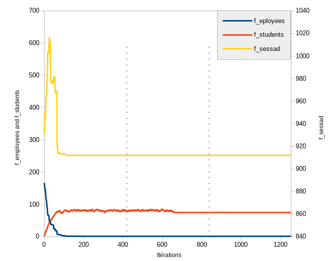

# **it45-project**
__UTBM P2022__  
Adrien Burgun, Oscar Dewasmes
<br><br>

## Compile
At the project's root :  
```
mkdir build
cd build
cmake ..

make
```

## Run
In the `build` folder :  
```
./it45-projet <path to data folder> <Number of iterations> <cut_off>
```

For example : `./it45-projet ../Instances/100-10/ 8 200`

The `cut_off` value is best left between 150 and 300


## Results
The best solution found is printed to the console.  
The agents time tables are stored in `edt.txt`.  
Log of the evolution of the solution can be found in `log.csv`.  
<br><br>

# **Presentation**
This project was realized for an operational research university class at the UTBM during the 2022 spring semester.

The aim of the program is to assigned missions to agents to generate a time table for all of the agents. This is done respecting travelling constraints, agents having matching skills to the missions and so on...  
The objectives that are optimized here are the balance of the work between the agents, the number of missions realized by agents having the correct skill and the total distance traveled by the agents.

We resolved ths problem with the __simulated annealing algorithm__.

The subject is available [here](report/Subject.pdf) in french.  
our report representing our result is available [here](report/Rapport.pdf) in english.
<br><br>

Here is a short summary of our results shown with cool graphs :


Here is a representation of the success rate of our program at finding an initial solution in function of the number of missions and agents.<br><br>


Here is a better representation of the evolution of the 3 different objectives :
- f_employees : The work balance between agents, overtime and standard deviation in travel distance
- f_students : The amount of assignments with miss matched mission/agent skill
- f_sessad : The total distance traveled, lost hours and overtime

On that last graph, the vertical lines represent the change of optimized objective in the cascade of optimization.<br><br>


Here is the evolution of 10 solutions in the space of objectifs. We can see that all our initial solutions come from the same place (left on the graph) and stagnate together (top right) before converging to the same pool of final solutions (bottom right). It is due to the multi-objective cascade optimisation, the first objective optimisation takes the solution to the top right, then, when the second objective optimisation kicks in, it quickly converges (bottom right).<br><br>
